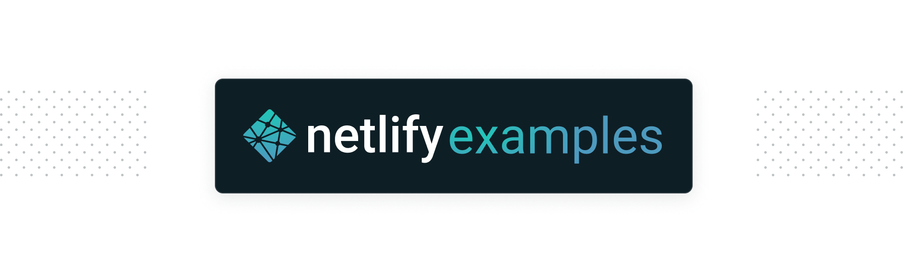

# Every Color

**View this demo site**: https://every-color.netlify.app

[](https://app.netlify.com/sites/every-color/deploys)


## About this example site

This site uses [Netlify's On-demand builders](https://www.netlify.com/blog/2021/04/14/faster-builds-for-large-sites-on-netlify-with-on-demand-builders-now-in-early-access/?utm_medium=social&utm_source=github&utm_campaign=devex-ph&utm_content=devex-examples) to dynamically generate a page for any requested valid CSS color in hex, RGB, or named formats.

On-demand builders generate a page the first time it is requested and then adds it to the most recent deployment for immediate serving for each subsequent request. This is an implementation of the Distributed Persistent Rendering (DPR) model.

- 📚 [Docs On-Demand Builders](https://docs.netlify.com/configure-builds/on-demand-builders/?utm_medium=social&utm_source=github&utm_campaign=devex-ph&utm_content=devex-examples)
- 🧑‍🏫 [About Distribute Persistent Rendering](https://www.netlify.com/blog/2021/04/14/distributed-persistent-rendering-a-new-jamstack-approach-for-faster-builds/?utm_medium=social&utm_source=github&utm_campaign=devex-ph&utm_content=devex-examples)


## Speedily deploy your own version

Deploy your own version of this example site, by clicking the Deploy to Netlify Button below. This will automatically:

- Clone a copy of this repo to your own GitHub account
- Create a new project in your [Netlify account](https://app.netlify.com/?utm_medium=social&utm_source=github&utm_campaign=devex-ph&utm_content=devex-examples), linked to your new repo
- Create an automated deployment pipeline to watch for changes on your repo
- Build and deploy your new site

[](https://app.netlify.com/start/deploy?repository=https://github.com/netlify/example-every-color&utm_medium=social&utm_source=github&utm_campaign=devex-ph&utm_content=devex-examples)


## Install and run this example locally

You can clone this example repo to explore its features and implementation, and to run it locally.

```shell

# 1. Clone the repository to your local development environment
git clone git@github.com:netlify/example-every-color.git

# 2. Move into the project directory
cd example-every-color

# 3. Install code dependencies
npm install

# 4. Install the Netlify CLI to let you locally serve your site using Netlify's features
npm install -g netlify-cli

# 5. Serve your site using Netlify Dev
netlify dev

```


